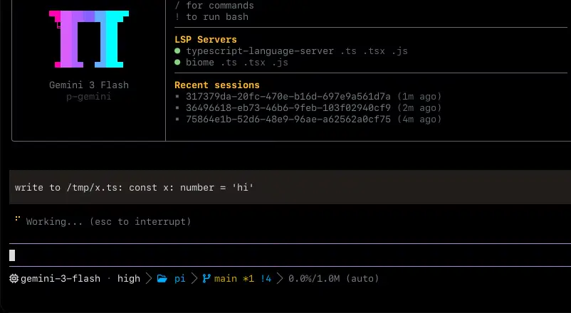

<!-- ⚠️ 本文件为社区汉化版，英文原版见上游仓库 can1357/oh-my-pi。翻译基于 upstream commit c09c7f11d0c9ee39a560e44963d54b9958625e84，可能滞后。 -->
> 🌐 **这是社区维护的中文翻译版** · [查看英文原版](https://github.com/can1357/oh-my-pi/blob/main/README.md)

<p align="center">
  
</p>

<p align="center">
  <strong>一个把 IDE 接进来的编程 agent。</strong>
  <strong><a href="https://omp.sh">omp.sh</a></strong>
</p>

<p align="center">
  <a href="https://www.npmjs.com/package/@oh-my-pi/pi-coding-agent"></a>
  <a href="https://github.com/can1357/oh-my-pi/blob/main/packages/coding-agent/CHANGELOG.md"></a>
  <a href="https://github.com/can1357/oh-my-pi/actions"></a>
  <a href="https://github.com/can1357/oh-my-pi/blob/main/LICENSE"></a>
  <a href="https://www.typescriptlang.org"></a>
  <a href="https://www.rust-lang.org"></a>
  <a href="https://bun.sh"></a>
  <a href="https://discord.gg/4NMW9cdXZa"></a>
</p>

<p align="center">
  基于 <a href="https://github.com/mariozechner">@mariozechner</a> 的 <a href="https://github.com/badlogic/pi-mono">Pi</a> 的 fork
</p>

目前发布过的最强 agent 载体。经真实使用持续打磨——开箱即完整，底层全部开放。

**60+** 家 provider · **31** 个内置工具 · **14** 个 LSP 操作 · **28** 个 DAP 操作 · 约 **~80k** 行 Rust 核心。

> [!NOTE]
> Pull request 目前**临时对所有人开放**，作为一次试行。我们此前要求在接收 PR 前先获得一位
> 现有贡献者的担保（vouch）；在我们评估开放贡献的效果期间，这一要求暂时取消。视结果
> 而定，vouch 机制可能会恢复。

## 安装

**macOS · Linux**

```sh
curl -fsSL https://omp.sh/install | sh
```

> **Alpine / musl：** 预构建的 musl 二进制动态链接了 `libstdc++`/`libgcc`，而原版 Alpine 并不自带。请先安装它们：`apk add libstdc++ libgcc`。

**Homebrew**

```sh
brew install can1357/tap/omp
```

**Bun（推荐）**

```sh
bun install -g @oh-my-pi/pi-coding-agent
```

**Nix**

```sh
# 免安装直接运行
nix run github:can1357/oh-my-pi

# 或安装到当前 profile
nix profile install github:can1357/oh-my-pi
```

Flake 使用方可以使用 `packages.<system>.omp`、`overlays.default`、`nixosModules.default` 或 `homeManagerModules.default`。Home Manager 配置可以声明式地安装 OMP 并接管其设置：

```nix
{
  inputs.omp.url = "github:can1357/oh-my-pi";

  # In your Home Manager module:
  imports = [ inputs.omp.homeManagerModules.default ];
  programs.omp = {
    enable = true;
    settings.startup.quiet = true;
  };
}
```

**Windows (PowerShell)**

```powershell
irm https://omp.sh/install.ps1 | iex
```

**锁定版本 (mise)**

```sh
mise use -g github:can1357/oh-my-pi
```

macOS · Linux · Windows · bun ≥ 1.3.14

### Shell 补全

`omp` 根据实时的命令/flag 元数据自行生成 **bash**、**zsh** 和 **fish** 的补全脚本，因此永远不会与实际 CLI 脱节。子命令、flag 和枚举值静态补全；模型名（`--model`、`--smol`、`--slow`、`--plan`）会根据内置模型目录解析，`--resume` 则根据磁盘上的会话解析。

```sh
# zsh — add to ~/.zshrc (or write the output into a file on your $fpath)
eval "$(omp completions zsh)"

# bash — add to ~/.bashrc
eval "$(omp completions bash)"

# fish
omp completions fish > ~/.config/fish/completions/omp.fish
```

## 每个工具都 _benchmaxxed_。

一次就能落地的编辑。读取文件时给出摘要而不是倾倒全文。搜索即刻返回。随便换哪个模型——omp 都能让它表现到位。

| model            | metric       | what                                                                  |
| ---------------- | ------------ | --------------------------------------------------------------------- |
| Grok Code Fast 1 | 6.7% → 68.3% | 一旦编辑格式不再把模型"吃掉"，成绩立刻提升十倍。 |
| Gemini 3 Flash   | +5 pp        | 相比 str_replace——超过了 Google 自己为该格式做出的最好尝试。     |
| Grok 4 Fast      | −61% tokens  | 一旦坏 diff 的重试循环消失，输出量大幅缩水。         |
| MiniMax          | 2.1×         | 通过率翻倍以上。同样的权重，同样的 prompt。               |

- `read` : 摘要式片段 · 理想的默认值 · selector 命中率
- `grep` : 西部最快的 grep
- `lsp` : IDE 知道的，agent 都知道
- `prompts` : 针对每个模型反复调校

[阅读完整文章 ↗](https://blog.can.ac/2026/02/12/the-harness-problem/)

## 你 _热爱_ 的 Pi，**电池全配**。

omp 最初构建于 [Mario Zechner](https://github.com/mariozechner) 的优秀作品 [Pi](https://github.com/badlogic/pi-mono) 之上，补齐了你所缺的一切。

### 01 · 带工具调用的代码执行

大多数 harness 给 agent 一个 Python 沙盒就完事了。我们的版本运行持久化的 Python 和一个 Bun worker，而且任一内核都能通过回环桥回调 agent 自己的工具——read、search、task。agent 在 Python 里用 tool.read 加载 CSV，再用 JavaScript 绘图，全程不离开单元格。


### 02 · LSP 接入每一次写入

要求重命名，得到的就是重命名。调用经过 workspace/willRenameFiles，因此 re-export、barrel 文件和别名 import 会在文件移动之前同步更新。IDE 知道的，agent 都知道。



_[阅读 LSP 配置文档](docs/lsp-config.md)_

### 03 · 驱动真正的调试器

一个 C 二进制段错误了：agent 附上 lldb，步进到坏指针，读取栈帧。一个 Go 服务卡死了：它附上 dlv 并遍历 goroutine。一个 Python 进程僵死了：debugpy、暂停、检查、求值。大多数 agent 还在到处撒 print 语句。


_[观看录屏 ↗](https://omp.sh/clips/dap.mp4)_

### 04 · 可以时间回溯的流规则

你的规则平时静默待命，直到模型跑偏。一次正则匹配会在 token 输出到一半时中止流，把规则作为系统提醒注入，并从原点重试。你得到了纠偏，却不用每一轮都付出上下文税。注入内容在 compaction 后依然保留，所以修正会持续生效。


_[观看录屏 ↗](https://omp.sh/clips/ttsr.mp4)_

### 05 · 一等公民的 subagent

把一个任务拆给多个 worker，拿回带类型的结果。task 扇出到隔离的 worktree，每个 worker 运行自己的工具面，最终产出是父级可直接读取的、经 schema 校验的对象。没有需要解析的散文，没有兄弟任务间的合并冲突，没有无人认领的修改。


_[观看录屏 ↗](https://omp.sh/clips/irc.mp4)_

扇出过程可以实时围观：`Alt+A` 打开 [Agent Hub](docs/agent-hub.md)，名册中显示每个 subagent 的当前活动和用量。点开一个即可阅读其实时 transcript、输入引导消息、唤醒一个停驻的 worker，或者干掉卡死的那个，而不必中止父会话。

### 06 · 第二个模型，注视每一轮。

把一个 reviewer 模型配到 'advisor' 角色，它就会读取主 agent 的每一轮动作，并内联注入批注——轻声提醒、疑虑，或硬性阻断。它运行在自己的上下文和模型上，所以能抓住执行者匆匆略过的东西。主 agent 看到批注后要么纠偏，要么告诉你它为什么不改。


_[观看录屏 ↗](https://omp.sh/clips/advisor.mp4)_

### 07 · 把链接递给别人，对方就进来了。

/collab 把你的实时会话放到一个 relay 上，返回一个链接——外加一张二维码。队友可以从另一个终端用 omp join 加入，或直接在浏览器里打开。以读写方式分享即可结对操作同一个 agent；/collab view 则给出只读链接，任何人都能围观但无法操控。帧在客户端加密；relay 永远看不到你的密钥。


_[观看录屏 ↗](https://omp.sh/clips/collab.mp4)_

### 08 · 读 arxiv 上的 pdf？小意思。

web_search 串联 23 个排序后的 provider，把找到的 URL 直接交给 read。Arxiv PDF、GitHub 页面、Stack Overflow 帖子都会以结构化 markdown 返回且锚点完整——与你处理本地文件用的是同一个工具面。引用、跳转、摘录，永远不会迷失来路。


_[观看录屏 ↗](https://omp.sh/clips/web.mp4)_

### 09 · 毫不妥协的原生实现。Windows 上也是。

其他 agent 通过 shell 调用 rg、grep、find 和 bash。很多机器上这些二进制并不存在；在存在的机器上，每次调用也要付出一次 fork-exec 往返。omp 把真正的实现直接链接进进程。ripgrep、glob、find：进程内完成。brush 就是那个 bash——会话跨调用存活，还有 58 个命令行工具（ls、sed、sort、xargs，甚至 jq）被移植进 builtins crate 并在进程内运行，零 fork/exec。同一个 omp 二进制可运行于 macOS、Linux 和 Windows——无需 WSL 桥接。

### 10 · 带优先级和结论的代码评审

对这次变更能否发布得到明确结论，每个问题按 P0 到 P3 排序并标注置信度。/review 会生成专门的 reviewer subagent，并行扫查分支、单个 commit 或未提交的改动。你先处理阻塞发布的问题；重要内容不会埋没在散文堆里。

### 11 · Hashline：按内容哈希编辑

完美的编辑，更少的 token。模型指向锚点而不是重新敲出想改的行，于是空白符之争和"字符串找不到"的重试循环就此消失。编辑一个已过期的文件时锚点会分歧——我们会在补丁污染任何内容之前拒绝它。Grok 4 Fast 在同样工作上少花 61% 的输出 token。

### 12 · GitHub 只是又一种文件系统

其他 harness 外挂 gh_issue_view、gh_pr_view、gh_search——每个都有 agent 得学、你得调试的一套参数。我们跳过了这些。read 本来就处理路径；PR 就是路径。教模型的接口只有一个，要保持正确的面也只有一个。

### 13 · 由 agent 自己打理的记忆

agent 会跨会话记住你的代码库。它用 retain 在运行中写入事实，用 learn 沉淀可复用的经验，用 recall 取回它们，并把每个会话压缩成一个心智模型，在下一个会话的第一轮加载。用 `memory.backend` 选择引擎——local、Hindsight 或 Mnemopi。默认按项目隔离，所以它对这个仓库学到的东西只留在这个仓库。

### 14 · ACP：可由编辑器驱动的 agent

在 Zed 里运行 omp，你得到的就是终端里驱动的同一个 agent——读取你正看着的 buffer，通过编辑器的保存路径写入，在编辑器的终端里开 shell。破坏性工具会暂停，弹出一次即可确认并忘掉的权限提示。没有桥，没有插件，没有需要保持同步的第二个大脑。

### 15 · 继承你其他工具已经写好的配置

每个 agent 都自带一个导入器并指望你做转换。omp 直接以原生形态读取磁盘上已有的八种格式——Cursor MDC、Cline .clinerules、Codex AGENTS.md、Copilot applyTo 等等。没有迁移脚本，没有 YAML 转 TOML 的搬运，没有"支持子集"的脚注。团队上季度写的配置今晚依然可用。

### 16 · omp commit：原子拆分，校验过的提交信息

omp 通过 git_overview、git_file_diff 和 git_hunk 读取工作树，然后把无关的改动拆成按依赖排序的原子 commit。存在循环时会在写入任何内容之前拒绝。源文件得分高于测试、文档和配置，所以头一条 commit 就是最要紧的那条。锁文件完全排除在分析之外。

### 17 · 读 PR。_走 skills._ 从 subagent 里抽 JSON。

十六种内部 scheme——`pr://`、`issue://`、`agent://`、`skill://`、`ssh://` 等等——在 agent 已经在调用的每一个 FS 形态的工具里透明解析。`read pr://1428` 返回的形状与 `read src/foo.ts` 一致。`grep` 能像遍历目录一样遍历 diff。`agent://<id>/findings.0.path` 按路径从 subagent 的输出中抽取一个字段。

### 18 · 冲突解决，轻而易举。

每个合并冲突都变成一个 URL。agent 向 `conflict://N` 写入 `@theirs`、`@ours` 或 `@base`，文件即干净解决。批量形式：`conflict://*`。


_[观看录屏 ↗](https://omp.sh/clips/conflict.mp4)_

### 19 · 先预览，再接受。

`ast_edit` 返回一张 _(proposed)_ 卡片并附替换次数。变更处于暂存状态。agent 向 `xd://resolve` 写入一行理由；TUI 把它变成一张 **Accept** 卡片，磁盘上的落盘随即发生——原子化，要么全做要么不做。


_[观看录屏 ↗](https://omp.sh/clips/codemod.mp4)_

### 20 · 驱动 _真正的浏览器_。_顺便连你的 Slack？_

Eval 的 `browser.open(...)` 返回一个 tab 句柄，支持直接导航、检查、交互和元素辅助方法；`tab.run(...)` 处理自定义 JavaScript。它在隔离的 tab 运行时中驱动 Chromium 或 Electron。隐身默认开启，而 browser relay 还能接管你已打开的 Chrome 标签页且不抢焦点。

### 21 · 亲手握住桌面本身

Eval 的 `computer` 辅助方法——`computer.window(...)`、`win.screenshot()`、`win.ax()`、`el.press()`，外加用于多步脚本的 `computer.run(fnOrCode, options)`——控制真实的主机：枚举窗口和显示器、截屏、发送原生输入、遍历操作系统无障碍树，以及使用剪贴板。它不暴露任何浏览器 DOM。

## 任务需要什么，_箱子里就已经有什么_。

核心工具与 `read` 和 `bash` 同处一个命名空间。用 `--tools read,edit,bash,…` 固定活跃工具集；少用的可发现工具藏在 `xd://` 设备之后。`read xd://` 列出它们，启用 `tools.xdev` 后 `write xd://<tool>` 可运行其中之一。

**文件与搜索**

- `read` — 文件、目录、归档、SQLite、PDF、notebook、URL、远程 `ssh://` 路径，以及通过同一路径访问的内部 `://` scheme。
- `write` — 创建或覆盖文件、归档条目或 SQLite 行。
- `edit` — 带内容哈希锚点和过期锚点恢复的 hashline 补丁。
- `ast_edit` — 结构化重写，应用前可预览，基于 ast-grep。
- `ast_grep` — 覆盖 50+ tree-sitter 语法的结构化代码查询。
- `grep` — 对文件、globs 和内部 URL 的正则搜索。
- `glob` — 基于 glob 的路径查找；需要内容匹配时请用 `grep`。

**运行时**

- `bash` — 工作区 shell，内置 46 个进程内 coreutils、可选 PTY 和后台任务分发。
- `eval` — 持久化的 Python 和 JavaScript 单元，共享 prelude 并可回调工具。

**代码智能**

- `lsp` — 诊断、导航、符号、重命名、代码操作、原始请求。
- `debug` — 驱动 DAP 会话——断点、步进、线程、栈、变量。
- `security_scan` — 规划并执行原生安全评审；驱动 Codex Security 云端扫描。

**协调**

- `task` — 并行扇出 subagent，可选工作区隔离。
- `hub` — 给活跃 agent 发消息、等待或取消后台任务、监督长驻进程。
- `todo` — 对会话 todo 列表进行带阶段跟踪的有序变更。
- `ask` — 为交互式运行提供结构化的后续提问。

**桌面与 Web**

- `browser` — 基于 headless Chromium、CDP 附着的应用或经由 relay 接管的你自己的 Chrome 的 Puppeteer 标签页。
- `computer` — 对主机桌面的持久化 JS：窗口、截图、原生输入、AX 树、剪贴板。
- `web_search` — 一条查询覆盖已配置的 provider，返回答案和引用。
- `github` — GitHub CLI 操作——repo、PR、issues、代码搜索、Actions 运行监控。
- `generate_image` — 通过 Gemini、GPT 或 xAI Grok 图像模型生成或编辑位图图像。
- `tts` — 通过 xAI Grok Voice 的文本转语音——五个内置音色，WAV 或 MP3。

**记忆与 skills**

- `checkpoint` — 标记会话状态，供之后"折叠并汇报"。
- `rewind` — 修剪探索性上下文，保留一份简洁报告。
- `retain` — 把持久事实排入活跃记忆库。
- `recall` — 在记忆库中搜索原始记忆。
- `reflect` — 在记忆库上综合出答案。
- `memory_edit` — 按 id 更新、遗忘或作废已存记忆。
- `learn` — 沉淀一条可复用经验；可选择提升为受管理的 skill。
- `manage_skill` — 创建、更新或删除一个隔离的受管理 skill。

需设置开启、默认关闭：`github`、`security_scan`、`generate_image`、`tts`、`checkpoint`、`rewind`，以及记忆工具（`retain`/`recall`/`reflect`/`memory_edit`，取决于 `memory.backend`）。

[完整参考 →](https://omp.sh/docs/tools)

### Prompt 控制

三个独立的小写单词可以让一轮对话启用特殊的 agent 行为：

- `ultrathink` — 请求细致的多步推理和所支持的最高自动思考强度。
- `orchestrate` — 通过并行 subagent 执行大规模独立工作，并逐阶段验证。
- `workflowz` — 用当前 `task` 工具构建确定性的多 subagent 工作流。

它们只在自然语言文本中触发，不会在代码片段、围栏代码块、XML/HTML 区域、标识符或路径中触发。精确的匹配规则与配置见 [Magic keywords](docs/magic-keywords.md)。

### 会话控制

斜杠命令改变整个会话的运行方式：

- `/vibe` — 进入 [Vibe mode](docs/vibe-mode.md)：扮演导演，以 `read`-only 工具集驱动持久的 `fast`/`good` worker 会话。
- `/fresh` — 重置 provider 流状态（过期 prompt 缓存、卡死的流）而不改动本地 transcript。见 [Session operations](docs/session-operations-export-share-fork-resume.md#fresh)。

## 60 多家 provider，上千个模型，_一条 /model 之遥_。

九种角色按意图分派工作。`default` 处理常规轮次。`smol` 用于廉价的 subagent 扇出。`slow` 用于深度推理。`plan` 用于 plan mode。`commit` 用于 changelog。再加上与 `vision`、`task`、`advisor`、`tiny` 同名的各自角色。启动时用 `--smol`、`--slow` 或 `--plan` 覆盖；用 `Ctrl+P` 在当前角色的已配置模型间轮换。会话中途用 `/model` 斜杠命令切换当前模型。

下方的 auth 标签：`oauth` 用你的 provider 账号登录，`plan` 走 coding-plan 订阅，`local` 连接本地服务器且密钥可选。

### Frontier APIs

直连 API 与网关。可按角色混用 provider。

Anthropic `oauth` · OpenAI · OpenAI Codex `oauth` · Google Gemini · Google Vertex · Google Antigravity `oauth` · xAI · SuperGrok `oauth` · DeepSeek · Mistral · Groq · Cerebras · Fireworks · Together · Baseten · DeepInfra · Hugging Face · NVIDIA · Meta · Amazon Bedrock · Azure OpenAI · SiliconFlow · GMI Cloud · CoreWeave · Sakana AI · OpenRouter · Synthetic · Vercel AI Gateway · Cloudflare AI Gateway · Wafer Serverless

### Coding plans

按订阅路由。`/login` 将会话接入。

Cursor `oauth` · GitHub Copilot `oauth` · GitLab Duo · Devin `oauth` · Kimi Code `plan` · Moonshot · MiniMax Coding Plan `plan` · MiniMax Coding Plan CN `plan` · Alibaba Coding Plan `plan` · Qwen Portal `oauth` · Z.AI / GLM Coding Plan `plan` · Zhipu Coding Plan `plan` · Xiaomi MiMo · Qianfan · Umans `plan` · NanoGPT · Novita · Venice · Kilo · ZenMux · OpenCode Go · OpenCode Zen

### 自托管运行

OpenAI 兼容的 `/v1/models`。本地实例可跳过密钥。

Ollama `local` · Ollama Cloud · LM Studio `local` · llama.cpp `local` · vLLM `local` · LiteLLM

### 自定义 OpenAI 兼容 provider

在 `~/.omp/agent/models.yml` 中定义自定义 provider：

```yaml
providers:
  spark:
    baseUrl: http://192.168.10.223:8000/v1
    api: openai-completions
    apiKey: dummy
    models:
      - id: minimax-m3
        name: MiniMax M3
        contextWindow: 100000
        maxTokens: 32000
```

运行 `omp models spark` 验证发现。然后运行 `omp setup` 并在默认模型步骤中选择该模型，或在会话中打开 `/model` 把它分配给 `default` 角色。

要跳过选择器直接预配置默认模型，把 selector 加入 `~/.omp/agent/config.yml`：

```yaml
modelRoles:
  default: spark/minimax-m3
```

### 让路由真正有用的四个旋钮

- **自定义 provider** — 在 `~/.omp/agent/models.yml` 中声明任何说 `openai-completions`、`openai-responses`、`openai-codex-responses`、`azure-openai-responses`、`anthropic-messages`、`bedrock-converse-stream`、`google-generative-ai`、`google-gemini-cli` 或 `google-vertex` 的服务。
- **Fallback 链** — `retry.fallbackChains` 下按角色或按模型配置链路。当主选模型抛出 429 或撞上配额墙时，下一个条目接手本轮剩余部分——冷却后自动恢复。
- **按路径限定模型** — 把 `enabledModels` 和 `disabledProviders` 条目限定到 `path:` 前缀，即可在单个仓库上固定另一组模型而不动全局配置。限定条目覆盖该路径及其下所有内容。
- **轮换凭据** — 每个 provider 堆叠多个 API key，运行时会按会话亲和性和每凭据退避进行轮换。当一个 key 不到中午就烧光配额时尤其有用。

完整的 provider 与路由参考见 [omp.sh/docs/providers](https://omp.sh/docs/providers)。

## 23 个后端。_一个 agent 本来就认识的工具_。

`web_search` 是内置的，不是外挂的。`auto` 会沿 23 个 provider 的链路依次尝试；如果你已经付费订阅，也可以按名字固定一个。每一次命中背后，站点感知的抽取把 GitHub、注册表、arXiv、Stack Overflow 和文档站转成结构化 markdown——锚点和链接目标原样保留。

### 搜索 provider

23 个后端。固定一个，或让 `auto` 按顺序走完整条链。

| provider     | auth                                      |
| ------------ | ----------------------------------------- |
| `auto`       | chain                                     |
| `perplexity` | `PERPLEXITY_API_KEY` (anonymous fallback) |
| `gemini`     | oauth                                     |
| `anthropic`  | oauth                                     |
| `codex`      | oauth                                     |
| `xai`        | oauth or `XAI_API_KEY`                    |
| `zai`        | `ZAI_API_KEY`                             |
| `exa`        | `EXA_API_KEY` (or mcp)                    |
| `tinyfish`   | `TINYFISH_API_KEY`                        |
| `jina`       | `JINA_API_KEY`                            |
| `kagi`       | `KAGI_API_KEY`                            |
| `tavily`     | `TAVILY_API_KEY`                          |
| `firecrawl`  | `FIRECRAWL_API_KEY` (keyless fallback)    |
| `brave`      | `BRAVE_API_KEY`                           |
| `kimi`       | `/login kimi-code` or search key          |
| `parallel`   | `PARALLEL_API_KEY`                        |
| `synthetic`  | `SYNTHETIC_API_KEY`                       |
| `searxng`    | self-hosted                               |
| `duckduckgo` | no key                                    |
| `startpage`  | no key                                    |
| `google`     | no key (browser)                          |
| `ecosia`     | no key (browser)                          |
| `mojeek`     | no key (browser)                          |
| `public`     | no key (all of the above, consolidated)   |

Exa 也接受通过 `/login exa` 存储的 API key；显式选择无密钥模式时使用公共 MCP fallback。

### 专用处理器

agent 拿到的是结构化内容，而不是被剥光的 HTML。

- **代码托管** — github, gitlab
- **包注册表** — npm, PyPI, crates.io, Hex, Hackage, NuGet, Maven, RubyGems, Packagist, pub.dev, Go packages
- **学术来源** — arxiv, semantic scholar
- **论坛** — stack overflow, reddit, hn
- **文档** — mdn, readthedocs, docs.rs

页面转换为 markdown 时链接结构完整保留。agent 可以引用、跳转、摘录而不丢失锚点。

### 安全数据库

漏洞查询返回的是厂商数据，不是博客摘要。

- **NVD** — 国家漏洞数据库
- **OSV** — 开源漏洞订阅源
- **CISA KEV** — 已知被利用漏洞

[`web_search` 参考 ↗](https://omp.sh/docs/tools#web_search)

## 约 **~80,000** 行 Rust，替其他 harness 外包出去的活干完。

六个 crate，一个带平台标签的 N-API addon。搜索、shell、AST、高亮、PTY、桌面控制、图像解码、BPE 计数——全部在 libuv 池上进程内完成。热路径上没有 fork/exec。另有约 80k 行随包一同交付：brush bash fork，以及 58 个命令行工具——coreutils、findutils、sed、jq、基于 ripgrep 的 grep、fd、diff、moreutils——移植进 builtins crate 并直接编译进 shell。

- Crates: `pi-natives`, `pi-shell`, `pi-ast`, `pi-iso`, `pi-voice`, `pi-walker`
- Platforms: `linux-x64`, `linux-arm64`, `darwin-x64`, `darwin-arm64`, `win32-x64`, `win32-arm64` — x64 同时提供 AVX2 和 baseline 两个二进制

按 crate 统计，仅代码行：

| Crate         | What it does                                                                           |   ~LoC |
| ------------- | -------------------------------------------------------------------------------------- | -----: |
| pi-shell      | 嵌入式 bash 引擎 · 持久化会话 · 进程内 coreutils 分发 · minimizer | 38,000 |
| pi-natives    | N-API 表面——下表中的每个模块                                                    | 25,000 |
| pi-walker     | 并行、感知 ignore 的遍历器 + 由 grep · glob · workspace · shell 共享的扫描缓存    |  5,200 |
| pi-iso        | 工作区隔离 · apfs · btrfs · zfs · reflink · overlayfs · projfs · rcopy        |  3,300 |
| pi-ast        | tree-sitter + ast-grep 匹配、块解析、结构化摘要                |  2,900 |
| pi-voice      | 音频采集/播放 · Opus · 实时 WebRTC                                            |  1,000 |

`pi-natives` 内部，按模块细分（省略胶水代码和测试）：

| Module        | What it does                                                                      | Powered by                                |   ~LoC |
| ------------- | --------------------------------------------------------------------------------- | ----------------------------------------- | -----: |
| desktop       | 窗口/显示器枚举 · 截屏 · 原生输入 · 供 `computer` 使用的 AX 树   | xcap · enigo · OS AX FFI                  | 10,600 |
| grep          | 正则搜索 · 并行/串行 · glob 与类型过滤 · 模糊查找             | grep-regex · grep-searcher                |  3,280 |
| text          | 感知 ANSI 的宽度 · 截断 · 列切片 · 保留 SGR 的折行              | unicode-width · segmentation              |  2,070 |
| snapcompact   | 面向上下文压缩的位图帧光栅化 + PNG 编码                   | image · png                               |  1,760 |
| keys          | Kitty 键盘协议及 xterm 回退 · PHF 完美哈希查找             | phf                                       |  1,740 |
| ast           | ast-grep 模式匹配与结构化重写                                 | ast-grep-core                             |  1,510 |
| diff          | 面向工具与预览的结构化文件 diff                                    | in-tree                                   |  1,030 |
| pty           | 面向 sudo · ssh 交互提示的原生 PTY 分配                          | portable-pty                              |    630 |
| crash_handler | 原生崩溃捕获与上报                                                | in-tree                                   |    610 |
| highlight     | 语法高亮 · 11 个语义类别 · 30+ 别名                        | syntect                                   |    550 |
| appearance    | Mode 2031 + 经 CoreFoundation FFI 的原生 macOS 深色/浅色                        | core-foundation                           |    450 |
| task          | libuv 线程池上的阻塞工作 · 取消 · 超时 · 性能剖析           | tokio · napi                              |    440 |
| glob          | 带 glob 的发现 · 类型过滤 · mtime 排序 · 遵守 gitignore               | ignore · globset                          |    430 |
| fd            | 用作 find 替代品的文件系统遍历器                                       | ignore                                    |    385 |
| clipboard     | 从系统剪贴板复制文本和读取图像 · 不依赖 xclip/pbcopy                  | arboard                                   |    370 |
| workspace     | 一次遍历同时完成 gitignore + AGENTS.md 发现的工作区遍历器                 | ignore                                    |    275 |
| power         | 用于防止空闲/系统/显示器睡眠的 macOS power-assertion API                | IOKit FFI                                 |    270 |
| prof          | 带 folded-stack 与 SVG 火焰图输出的环形缓冲剖析器              | inferno                                   |    240 |
| file_lock     | 跨进程咨询式文件锁                                               | in-tree                                   |    210 |
| ps            | 跨平台进程树终止与后代列举                           | libc · libproc · CreateToolhelp32Snapshot |    195 |
| tokens        | O200k / Cl100k BPE token 计数 · 两张表都内嵌                          | tiktoken-rs                               |     70 |
| html          | 可选内容清洗的 HTML 转 Markdown                                   | html-to-markdown-rs                       |     60 |
| sixel         | 终端图像渲染 · 解码 PNG · JPEG · WebP · GIF · 缩放 · SIXEL 编码 | icy_sixel · image                         |     55 |

## 四个入口：_交互式_、_一次性_、RPC 和 ACP。

同一个引擎，四种封装。`omp` 运行 TUI。`omp -p` 回答单条 prompt 后退出。Node SDK 把会话嵌入你的进程。`omp --mode rpc` 和 `omp acp` 则通过 stdio 把方向盘交给另一个程序。

### 交互式——拿不准时，agent 会问

TUI 是默认界面。工具调用渲染为卡片，编辑落地前先预览，歧义通过 `ask` 工具路由——一个 agent 可在轮次中途调用的结构化选项选择器。键盘处理其余一切。

同样的 prompt 卡片也会通过 ACP 呈现，编辑器无需自写选择器即可使用。


### SDK——嵌入 Node

`@oh-my-pi/pi-coding-agent`

Node 和 TypeScript 宿主直接引入引擎。该包暴露 `ModelRegistry`、`SessionManager`、`createAgentSession` 和 `discoverAuthStorage`；会话以类型化事件的形式供你订阅。

```ts
import {
  ModelRegistry,
  SessionManager,
  createAgentSession,
  discoverAuthStorage,
} from "@oh-my-pi/pi-coding-agent";

const auth = await discoverAuthStorage();
const models = new ModelRegistry(auth);
await models.refresh();

const { session } = await createAgentSession({
  sessionManager: SessionManager.inMemory(),
  authStorage: auth,
  modelRegistry: models,
});
await session.prompt("list .ts files");
```

### RPC——通过 stdio 驱动

`omp --mode rpc`

适用于非 Node 宿主，或当你想要进程隔离时。NDJSON 命令进，响应与事件帧出。`--mode rpc-ui` 额外以 `extension_ui_request` 帧提供工具卡片、选择器和对话框，宿主必须应答。

```
$ omp --mode rpc --no-session
> {"id":"r1","type":"prompt","message":"list .ts files"}
< {"id":"r1","type":"response", ...}
> {"id":"r2","type":"set_model","provider":"anthropic","modelId":"sonnet-4.5"}
> {"id":"r3","type":"abort"}
```

### ACP——与编辑器对话

`omp acp`

基于 JSON-RPC 的 [Agent Client Protocol](https://github.com/zed-industries/agent-client-protocol)。当编辑器宣告能力时，工具 I/O 经由它路由，写入由 `session/request_permission` 把关。

| omp tool     | ACP route                           |
| ------------ | ----------------------------------- |
| `bash`       | `terminal/create + terminal/output` |
| `read`       | `fs/read_text_file`                 |
| `write`      | `fs/write_text_file`                |
| `edit, bash` | `session/request_permission`        |

完整参考：[omp.sh/docs/sdk](https://omp.sh/docs/sdk)。

## 值得留下的 harness，是你 _不会_ 长大后抛弃的那种。

到 **[omp.sh](https://omp.sh)** 拿起它。

omp 是 [Mario Zechner](https://github.com/mariozechner) 的 [Pi](https://github.com/badlogic/pi-mono) 的一个 fork，重写为编程优先的界面：sessions、subagents、斜杠命令、扩展——全是 TypeScript，全是 MIT，全在 [GitHub](https://github.com/can1357/oh-my-pi)。用配置塑形它，从外部挂钩它，或在需要时阅读源码。

### 原语

一个扩展就是一个 TypeScript 模块。与内置组件相同的工具 API、相同的斜杠命令注册表、相同的热键表、相同的 TUI 原语。没有任何东西被保留。

### 发现

首次运行时，omp 会继承磁盘上已有的一切：来自 `.claude`、`.cursor`、`.windsurf`、`.gemini`、`.codex`、`.cline`、`.github/copilot` 和 `.vscode` 的 rules、skills 和 MCP server。没有迁移脚本。

### 可扩展性

让 omp 写出你缺的那一块，然后 `/reload-plugins`。可以留在本地，放进 `marketplace`，或发布到 npm。

## Philosophy

omp 是 [Mario Zechner](https://github.com/mariozechner) 的 [pi-mono](https://github.com/badlogic/pi-mono) 的 fork，扩展出电池全配的编程工作流。

核心思想：

- 为真实的编程工作保留交互式、终端优先的 UX
- 内置实用的组件（工具、会话、分支、subagent、扩展性）
- 让高级行为可配置，而不是藏起来

---

## 开发

### 从源码上手

全新 clone 在源码 CLI 启动前，需要同时安装工作区依赖和本地 Rust/N-API addon。

```sh
bun setup
bun dev
```

`bun setup` 安装 Bun workspaces 并构建 `@oh-my-pi/pi-natives`。更改 Rust crate 或 `packages/natives` 后请重新运行 `bun run build:native`。

Nix 用户可获得锁定版本的 Bun 和 Rust 工具链以及全部原生构建依赖：

```sh
nix develop
bun setup
bun dev
```

用 `nix build .#omp` 构建并冒烟测试可分发的 Nix 包。Wayland 屏幕共享默认关闭（链接 libpipewire 会给运行时闭包增加约 750 MB）；可用 `omp.override { withWaylandScreencast = true; }` 启用。`nix/bun.nix` 仅在 `bun.lock` 变化时重新生成；发布流程会自动重新生成。依赖变更时，运行：

```sh
bun run gen:nix
```

该命令在可用时使用 `nix develop` 中的 `bun2nix`，否则经由 Nix 进入开发 shell，再回退到锁定版本的 `bunx bun2nix@2.1.2`。不要手动编辑 `nix/bun.nix`。

非交互冒烟检查：

```sh
bun dev -- --version
```

### Debug 命令

`/debug` 打开用于调试、报告和性能剖析的工具。

架构与贡献指南见 [packages/coding-agent/DEVELOPMENT.md](packages/coding-agent/DEVELOPMENT.md)。

---

## Monorepo 包

| Package                                                                       | Description                                                                 |
| ----------------------------------------------------------------------------- | --------------------------------------------------------------------------- |
| **[@oh-my-pi/collab-web](packages/collab-web)**                               | collab 实时会话的浏览器访客客户端、mock host 与本地 relay   |
| **[@oh-my-pi/pi-ai](packages/ai)**                                            | 多 provider LLM 客户端，支持流式输出与模型/provider 集成     |
| **[@oh-my-pi/pi-catalog](packages/catalog)**                                  | 模型目录：内置模型数据库、provider 描述符与身份识别   |
| **[@oh-my-pi/pi-agent-core](packages/agent)**                                 | 带工具调用与状态管理的 agent 运行时                        |
| **[@oh-my-pi/pi-coding-agent](packages/coding-agent)**                        | 交互式编程 agent CLI 与 SDK                                        |
| **[@oh-my-pi/pi-tui](packages/tui)**                                          | 差分渲染的终端 UI 库                                           |
| **[@oh-my-pi/pi-natives](packages/natives)**                                  | 面向 grep、shell、图像、文本、语法高亮等的 N-API 绑定  |
| **[@oh-my-pi/omp-stats](packages/stats)**                                     | AI 用量统计的本地可观测性面板                       |
| **[@oh-my-pi/omptype](packages/omptype)**                                     | 兼容 ArkType 的 schema 校验，带惰性 JIT 编译              |
| **[@oh-my-pi/pi-utils](packages/utils)**                                      | 共享工具集（日志、流、目录/环境/进程辅助）               |
| **[@oh-my-pi/pi-wire](packages/wire)**                                        | 共享的 collab 实时会话协议类型与 relay 常量               |
| **[@oh-my-pi/hashline](packages/hashline)**                                   | `edit` 工具背后按行锚定的补丁语言与应用器             |
| **[@oh-my-pi/pi-mnemopi](packages/mnemopi)**                                  | 面向 Oh My Pi agent 的本地 SQLite 记忆引擎                              |
| **[@oh-my-pi/snapcompact](packages/snapcompact)**                             | 位图帧上下文压缩包与 SQuAD 评测套件               |
| **[@oh-my-pi/browser-relay](packages/browser-relay)**                         | 让 Eval 浏览器 API 驱动你现有标签页的 Chrome 扩展    |
| **[@oh-my-pi/pi-metaharness](packages/metaharness)**                          | 统一的基准测试运行器、Harbor 运行存储、REST/SSE API、实时面板 |
| **[@oh-my-pi/typescript-edit-benchmark](packages/typescript-edit-benchmark)** | 基于 TypeScript 源码变异的编辑基准套件                   |

### Rust Crates

| Crate                                              | Description                                                                                         |
| -------------------------------------------------- | --------------------------------------------------------------------------------------------------- |
| **[pi-natives](crates/pi-natives)**                | 供 `@oh-my-pi/pi-natives` 使用的核心 Rust 原生 addon（N-API `cdylib`）；聚合下方的各 crate |
| **[pi-shell](crates/pi-shell)**                    | 从 `pi-natives` 中拆出的嵌入式 shell / PTY / 进程管理（封装 `brush-*`）               |
| **[pi-ast](crates/pi-ast)**                        | 基于 tree-sitter 的代码摘要器与 AST 工具（50+ 语言语法）                         |
| **[pi-iso](crates/pi-iso)**                        | 任务隔离后端解析器：APFS 克隆、btrfs/zfs reflink、overlayfs、projfs、rcopy          |
| **[pi-voice](crates/pi-voice)**                    | 音频采集/播放、Opus 编解码与实时 WebRTC 流原语                           |
| **[pi-walker](crates/pi-walker)**                  | 并行、感知 ignore 的文件系统遍历器，带由 grep、glob 和 workspace 共享的扫描缓存     |
| **[brush-core](crates/vendor/brush-core)**         | [brush-shell](https://github.com/reubeno/brush) 的 vendored fork，用于嵌入式 bash 执行        |
| **[pi-builtins](crates/pi-builtins)**              | Bash 内建命令（cd, echo, test, printf, read, export, …）外加 67 个进程内命令行工具 |

## 贡献

Issues 和 pull request 对所有人开放。当前的开放 PR 是一次
**试行**——在我们评估效果期间，此前的 vouch 要求已取消，
之后可能恢复。贡献指南见 **[CONTRIBUTING.md](CONTRIBUTING.md)**。

---

## 许可证

OMP 以 [MIT License](LICENSE) 授权。

第三方与 vendored 代码，包括 `crates/vendor/brush-core` 以及
`crates/pi-builtins/LICENSE` 中标明的第三方部分，仍遵循
其各自的上游许可证。署名与附加条款见 `THIRD-PARTY-NOTICES.txt` 及
各组件自身的声明。

© 2025 Mario Zechner  
© 2025-2026 Can Bölük  
© 2026 Stencil Labs, Inc.

_为常开的终端而作_

- [omp.sh](https://omp.sh)
- [GitHub](https://github.com/can1357/oh-my-pi)
- [Changelog](https://github.com/can1357/oh-my-pi/blob/main/packages/coding-agent/CHANGELOG.md)
- [npm](https://www.npmjs.com/package/@oh-my-pi/pi-coding-agent)
- [Discord](https://discord.gg/4NMW9cdXZa)
- [MIT](https://github.com/can1357/oh-my-pi/blob/main/LICENSE)
